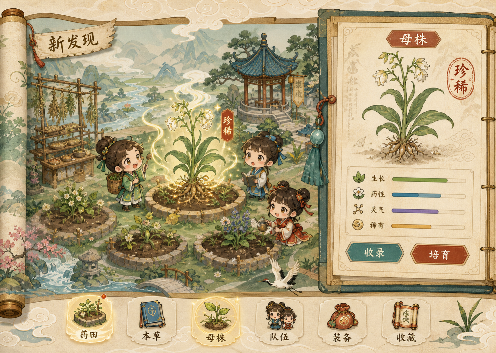
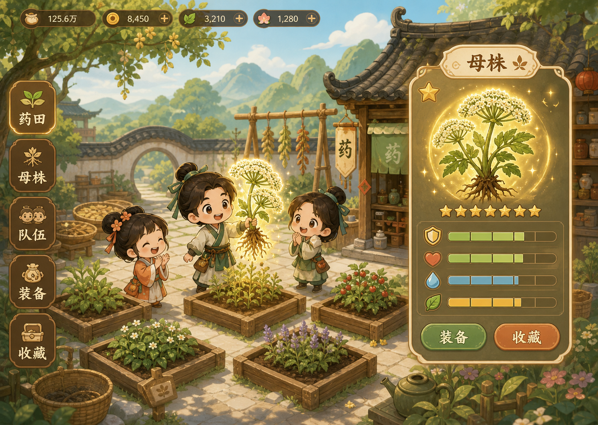
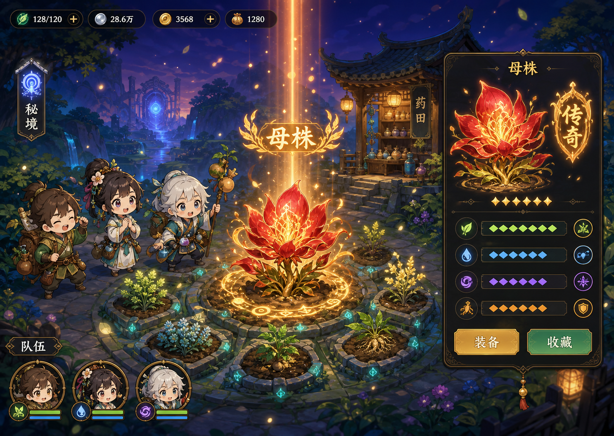

# 《百草药园》游戏设计文档（GDD）

> 文档版本：0.1  
> 日期：2026-08-28  
> 产品状态：Windows 可安装 Demo 设计基线  
> 暂定名：《百草药园》  

## 1. 产品概述

《百草药园》是一款以中药文化为主题的单机放置刷宝 RPG。玩家经营药田、收获随机母株、鉴定词条、培养随机弟子、配置方剂与自动释放规则，再用不同 BD 攻略生产任务、疑难坐诊和秘境副本。

核心体验不是模拟现实诊疗，而是把“暗黑式装备刷取与词条构筑”转译为“母株培育与本草收集”：普通药材作为可消耗资源，稀有母株作为永久装备与育种核心。

### 1.1 产品定位

| 项目 | 结论 |
|---|---|
| 类型 | 放置挂机 + 刷取构筑 + 种田经营 + 自动战斗 RPG |
| 主题 | 中药文化与幻想本草世界 |
| 平台 | 第一阶段仅发布 Windows 10/11 安装版 |
| 模式 | 纯单机，不含付费抽卡、联网排行和强制周常 |
| 主线长度 | 10～15 小时主动游玩，约 1～2 周自然完成 |
| 单次上线 | 5～15 分钟 |
| Demo 目标 | 30～45 分钟完整纵向切片 |
| 技术方向 | Vue 3 + TypeScript + PixiJS + Tauri 2 |

### 1.2 设计支柱

1. **每次收获都有期待**：母株品质、词条组合、数值百分位和传奇异变共同制造刷宝兴奋感。
2. **刷到的东西必须有用武之地**：生产、坐诊与副本分别检验不同 BD，而非单纯比较战力数字。
3. **失败促进调整，而非惩罚**：战败不消耗核心资源，报告明确解释循环、药气和状态问题。
4. **中药文化真实可辨，幻想规则明确分栏**：文化资料经过来源校核，战斗效果明确标为游戏设定。
5. **尊重玩家时间**：成熟不枯萎、离线正常结算、没有数天的纯等待墙。

## 2. 核心循环

```text
选择种源并种植
      ↓
离线生长与上线收获
      ↓
获得普通药材 / 随机母株
      ↓
鉴定、比较、装备、收藏、提炼
      ↓
配置弟子、方剂、母株与自动规则
      ↓
攻略生产任务 / 疑难坐诊 / 秘境副本
      ↓
获得稀有种源、图谱、招募线索和培育资源
      ↓
完善或建立新的 BD
```

三个主要模块按游玩决策量大致均衡：药田 40%、队伍与副本 40%、坐诊 20%。它们使用同一套母株、方剂与弟子构筑，不发展成互不相干的小游戏。

### 2.1 三环产出

| 模块 | 核心产出 | 核心判断 |
|---|---|---|
| 药田 | 普通药材、母株、变异种子 | 种什么、留什么、如何育种与洗练 |
| 副本 | 稀有种源、词条材料、弟子线索 | 用什么 BD、方剂顺序和弟子组合 |
| 坐诊 | 铜钱、声望、医德、图谱 | 如何辨证、覆盖兼证并控制副作用 |

## 3. 主线成长结构

| 阶段 | 主动时间 | 主要解锁 |
|---|---:|---|
| 荒地 | 0～1 小时 | 种植、鉴定、第一张方剂 |
| 沃土 | 1～3 小时 | 第二块田、首名弟子、自动战斗 |
| 灵田 | 3～6 小时 | 三人队伍、育种、疑难坐诊 |
| 福地 | 6～10 小时 | 传奇异变、词条嫁接、高级秘境 |
| 仙圃 | 10～15 小时 | 第 5～6 块田、最终区域、主线 Boss |

主线通关不要求六株毕业仙品。玩家只需形成机制正确、数值合格的队伍；完美词条与高层秘境属于通关后的自愿追求。

## 4. 药田与种植

### 4.1 田地规则

- 初始 1 块田，最终最多 6 块；
- 每块田独立升级、种植和激活母株；
- 高阶田可以种植低阶药材，方便定向刷取；
- 低阶种植的品质优势受药材熟练度与区域进度约束，避免高级田永久刷低阶红品成为唯一最优解；
- 作物成熟后永久停留在可收获状态，不会枯萎；
- 离线期间不会自动重复播种，除非未来解锁明确的弟子委派功能。

### 4.2 生长时间

| 阶级 | 生长时间 |
|---|---|
| 一阶 | 30 秒～5 分钟 |
| 二阶 | 10～20 分钟 |
| 三阶 | 30～60 分钟 |
| 四阶 | 2～4 小时 |
| 五阶 | 4～8 小时 |

新玩家在前 30 分钟内应完成 3～5 次完整收获循环。高阶长周期作物出现后，仍需保留短周期药材作为上线操作内容。

### 4.3 田地升级

每次升级仅设置两项主要门槛：一项阶段目标和一项资源消耗，不叠加铜钱、稀有材料、高品质药材、声望、建造时间等多重门槛。

| 升级 | 建造时间建议 |
|---|---:|
| 1→2 | 5 分钟 |
| 2→3 | 30 分钟 |
| 3→4 | 2 小时 |
| 4→5 | 6 小时 |

## 5. 母株刷宝系统

### 5.1 永久母株与消耗药材

- 普通收获物用于合方、升级、坐诊和出售；
- 收获时有概率出现“灵光”，生成一株永久母株；
- 母株进入百草园，可装备、收藏、育种、嫁接或提炼；
- 母株不会因战斗或坐诊被消耗；
- 装备母株影响药田生产、方剂表现与全队 BD。

### 5.2 母株结构

```text
药材种类 + 药龄等级 + 品质 + 固有特性 + 随机词条 + 可选传奇异变
```

示例：

> 赤霞当归｜极品｜药龄 42  
> 固有：补血类游戏方剂基础效果 +12%  
> 治疗暴击率 +9.6%（范围 5%～10%）  
> 护盾持续时间 +18%（范围 10%～20%）  
> 收获时 8% 概率获得双份子株  
> 弟子生命低于 40% 时治疗速度 +25%

### 5.3 品质与词条

| 品质 | 词条结构 | 定位 |
|---|---:|---|
| 凡品 | 1 条 | 新手、提炼 |
| 良品 | 2 条 | 前期过渡 |
| 佳品 | 3 条 | 初级 BD |
| 珍品 | 4 条 | 中期主力 |
| 极品 | 4 条，数值下限更高 | 追求组合与高百分位 |
| 仙品 | 4 条 + 1 个传奇异变 | 改变玩法机制 |

仙品不保证强于极品。词条组合完美的极品可以优于不适配当前 BD 的仙品。

每条词条显示实际值、可能范围与当前百分位。品质不能只用颜色表达，还需搭配不同印章轮廓、音效和粒子形状。

### 5.4 词条类别

- **根性词条**：生长、产量、育种、变异概率；
- **药性词条**：伤害、治疗、护盾、状态效果；
- **触发词条**：暴击后、低血时、叠层后触发；
- **弟子词条**：强化职业、体质或阵位。

高品质母株至少保证两条药性或触发词条，不能全部落入经营属性。药材种类限制词条池，当归不会随机出完全无关的寒湿召唤词条。

### 5.5 重复母株处理

- 提炼：转换为药蕴；
- 洗练：只允许反复洗练一条普通词条；
- 嫁接：牺牲供体，将一条合法词条传给目标，成本逐次上升；
- 育种：父母株向子代传递部分属性，仍保留随机波动；
- 图鉴：记录获得过的最高品质和最高词条数值；
- 收藏锁：阻止误提炼和误嫁接。

传奇异变不能直接洗出。玩家可以修补“差一条毕业”的装备，但不能无成本制造完美母株。

### 5.6 掉落节奏目标

- 前 1 小时至少获得一株能形成 BD 的佳品；
- 2～3 小时获得首株保底仙品；
- 此后定向种植约 60～90 分钟遇到一次仙品；
- 主线通关时通常拥有 8～12 株仙品，其中 2～4 株适配当前 BD；
- 极品频繁提供词条比较，仙品负责机制改变与掉落仪式感。

实际概率不在设计阶段硬编码，通过批量模拟校准。原始构想中的固定品质概率表不作为最终实现依据。

## 6. BD 与药性共鸣

玩家可激活 6 株母株，并为主角与两名弟子分配共 6 个方剂。

| 游戏药性 | 战斗风格 | 代表药材候选 |
|---|---|---|
| 补益 | 治疗、护盾、越战越强 | 人参、黄芪、甘草 |
| 温热 | 爆发、灼烧、低血增伤 | 附子、生姜、肉桂 |
| 寒湿 | 减速、冻结、削弱 | 茯苓、黄连、泽泻 |
| 活血 | 攻速、暴击、流血 | 当归、川芎、红花 |
| 毒蚀 | 持续伤害、叠层引爆 | 半夏、全蝎、乌头 |
| 药灵 | 召唤、复制、协同攻击 | 灵芝、何首乌、雪莲 |

上述为幻想战斗标签，不等同于现实疗效。

不采用固定四件套。每株母株提供药性点数，达到阈值后解锁共鸣：

- 补益 3：获得治疗暴击；
- 补益 6：溢出治疗转化为护盾；
- 补益 9：护盾破裂时治疗全队；
- 补益 6 + 活血 3：治疗暴击提高行动速度。

混合标签形成复合 BD，例如补益活血、温热毒蚀、寒湿药灵。游戏至少提供 5 个完整预设栏，保存母株、方剂、弟子、阵位和自动规则。

挑战可通过抗性、时间压力和状态机制鼓励换 BD，但避免完全免疫和唯一解。

## 7. 方剂与炮制

### 7.1 战斗定位

- 母株相当于装备；
- 方剂相当于技能；
- 弟子职业相当于技能执行者；
- 炮制分支相当于技能符文。

普通战斗不会按场次消耗方剂药材。首次炼成后永久解锁战斗技能，药材用于升级方剂、解锁炮制分支、制作 Boss 丹药和完成坐诊。

### 7.2 配伍结构

正式方剂继续使用君、臣、佐、使结构表达角色权重，但自由组方不进入 Demo。经典方剂的组成、出处和文化内容必须经过资料校核，不能为了战斗数值擅自修改现实方名与组成。

Demo 的战斗技能使用明确标注为“游戏原创试作方”的幻想配伍，避免玩家误认为是真实处方。经典方剂只以审校完成的文化档案出现；未完成审校的条目不进入公开构建。

### 7.3 炮制

完整版本可包含净制、切制、炒制、蜜炙、酒蒸和醋制。Demo 只保留一种炮制分支，用来验证“同一方剂改变机制”的价值。炮制失败不永久摧毁高品质母株。

## 8. 三人队伍与随机弟子

### 8.1 队伍结构

- 主角药师 + 2 名弟子；
- 主角激活 6 株母株，决定全局 BD；
- 全队共装备 6 个方剂；
- 共享药气资源池；
- 阵位分为前阵与后阵，不做复杂走位。

### 8.2 弟子生成

```text
职业 + 资质 + 体质 + 2～4 条专长 + 性格 + 药材亲和
```

| 职业 | 定位 |
|---|---|
| 武医 | 承伤、反击、治疗转攻击 |
| 方师 | 治疗、护盾、净化、增益 |
| 丹师 | 灼烧、毒蚀、叠层爆发 |
| 针师 | 控制、加速、行动调节 |
| 药童 | 药气、掉落和队伍辅助 |
| 御灵师 | 召唤药灵、复制效果 |

资质影响成长和上限，但不支配最终价值；体质与专长组合决定是否适配 BD。专长池受职业和药性限制，避免完全无关的随机组合。

### 8.3 招募与传承

- 声望提升后弟子来访；
- 副本产出寻访线索；
- 每次显示 3 名候选，可全部拒绝；
- 不使用付费抽卡和真实时间周常；
- 老弟子出师后进入名录，返还大部分培养资源；
- 师徒传承可在职业与药性限制内保留一条专长；
- 出师弟子成为驻守 NPC，提供药田、药铺或寻访加成。

初始 12 个弟子栏位，完整版本扩展至 30 个，并提供筛选、锁定和队伍预设。

## 9. 全自动战斗与副本

### 9.1 战斗规格

- 实时自动战斗；
- 普通战斗 30～60 秒；
- Boss 90～180 秒；
- 支持 1×、2×、4×速度；
- 每名角色有普通行动、职业被动和两个方剂；
- 普通行动及特定效果产生药气，方剂消耗药气并受冷却限制。

### 9.2 自动释放条件

- 冷却完成立即使用；
- 队友生命低于指定比例；
- 敌人存在指定状态；
- 状态达到指定层数；
- 药气高于指定值；
- 仅对精英或 Boss 使用；
- 保留药气等待高优先级方剂。

玩家通过下拉条件和优先级配置，不编写脚本。

### 9.3 副本类型

- 主线秘境：解锁地区、药材与敌人；
- 种源秘境：定向掉落特定母株；
- 弟子试炼：招募线索与培养资源；
- 药性挑战：使用特殊规则鼓励换 BD；
- 区域 Boss：传奇种源和专属材料。

单机版不使用真实周历刷新。挑战可按章节或累计收获次数刷新。

### 9.4 战斗报告

战败不扣体力或核心资源。报告显示：

- 主要伤害与治疗来源；
- 方剂释放次数；
- 药气溢出或短缺时长；
- 状态覆盖率；
- 首名阵亡角色及致死原因；
- 一条可执行的调整建议。

## 10. 坐诊系统

### 10.1 普通坐诊

- 患者可在离线期间积累；
- 玩家根据简化症状选择方剂；
- 已完美处理过的医案可以委派弟子自动完成；
- 主要产出铜钱、基础声望和普通线索。

### 10.2 疑难医案

疑难医案是非战斗 Boss，具有主诉、可调查线索、隐藏证型、体质和用药限制。

```text
查看主诉 → 选择问诊方向 → 获得线索 → 配置疗程 → 分阶段结算 → 医案复盘
```

每个医案支持多种解法，按主证匹配、兼证覆盖、耗时、副作用、方剂成本和最终状态评分。高品质母株提高容错，但不能替代正确判断。

普通失败不扣声望；只有忽视明确禁忌时才小幅扣除。失败后允许重试并显示缺少的游戏药性和出错阶段。

## 11. 中药文化系统

### 11.1 三类信息标签

- **传统记载**：历史文献和传统理论；
- **现代规范与安全**：来源、保护、毒性与风险；
- **游戏设定**：词条、战斗药性与幻想效果。

三类内容必须在界面上明确分栏，不能把“治疗暴击”“寒毒爆炸”等游戏机制写成现实疗效。

### 11.2 本草图鉴

每种药材包含：

1. 识药：名称、别名、原植物、药用部位、产地与采收；
2. 本草：传统性味、归经、传统功用分类、古籍和典故；
3. 炮制：常见炮制方式、外观变化及传统解释；
4. 方剂：经典方剂中的位置、出处和历史背景；
5. 安全与保护：毒性、保护状态、混淆品和安全提醒。

### 11.3 游玩解锁

- 首次获得：名称和药用部位；
- 首次获得良品：产地与采收；
- 首次炮制：炮制档案；
- 首次用于审校方剂：方剂背景；
- 完成辨药任务：古籍与典故；
- 完成专题：插画、称号和田地装饰。

文化奖励以收藏和外观为主，不用巨大数值迫使玩家阅读。

### 11.4 内容安全

- 不提供现实剂量和自行用药建议；
- 乌头、附子等存在风险的药材必须附安全说明；
- 犀角、虎骨、麝香等保护动物或敏感来源不得作为鼓励现实采集的普通素材；
- 方剂和药材资料采用可靠来源并保存逐字段出处；
- 公开发布前进行中医药专业审校；
- 图鉴长期遵循“少而可靠”，不以数量替代准确性。

## 12. 经济系统

首版保留四种资源：

| 资源 | 主要来源 | 用途 |
|---|---|---|
| 铜钱 | 售药、坐诊、任务 | 种子、田地、基础培养 |
| 声望 | 坐诊、首通、图鉴 | 解锁地区、患者、弟子职业 |
| 医德 | 疑难坐诊、文化成就 | 稀有图谱、文化收藏 |
| 药蕴 | 提炼母株 | 洗练、嫁接、育种 |

经营价值遵循：卖方剂收益高于卖炮制药材，卖炮制药材高于卖原药材，但高收益需要时间、辅料或构筑投入。

沃土精华、灵泉水、地脉石等只作为首通钥匙或剧情物品，不扩张为多套重复刷取货币。

## 13. 离线系统

- 作物成熟后等待玩家收获；
- 弟子采药和已通关副本扫荡最多累计 24 小时；
- 离线结果先展示预览，再一次性入账；
- 结算使用保存时的队伍与随机状态；
- 系统时间倒退时按零离线时间处理，不扣资源；
- 不专门建设服务器反作弊，单机玩家可自行管理存档。

## 14. Demo 纵向切片

### 14.1 内容规模

- 1 个地区；
- 2 块药田、2 个田地等级；
- 6 种药材；
- 6 档品质；
- 约 20 条普通词条；
- 3 种传奇异变；
- 3 个弟子职业；
- 3～4 个游戏原创试作方；
- 6 场普通战斗、2 场精英、1 个 Boss；
- 4 名普通患者、1 个疑难医案；
- 6 份完整本草图鉴。

Demo 药材固定为甘草、黄芪、生姜、肉桂、当归、川芎，分别验证补益、温热和活血三套基础 BD。涉及的现实文化资料进入公开构建前必须完成来源校核。

### 14.2 必须验证的 BD

- 补益护盾流；
- 温热爆发流；
- 活血速攻流。

Boss 至少允许其中两套通过不同方式解决，第三套在其他挑战中占优。

### 14.3 Demo 包含

- 种植、离线生长与收获；
- 随机母株生成、鉴定、比较、装备、锁定和提炼；
- 六株母株配置；
- 主角与两名随机弟子；
- 六个方剂槽和自动释放条件；
- 自动战斗统计；
- 普通坐诊与一次疑难医案；
- 本地文件存档、自动备份、导出和导入；
- Windows 安装包与分辨率设置。

### 14.4 Demo 不包含

- 完整育种、复杂嫁接和弟子出师；
- 六种药性全部开放；
- 五个完整地区；
- 24 节气；
- 药铺经营；
- 无限秘境；
- 多周目、赛季和联网功能。

## 15. 美术方向

### 15.1 主视觉：百草绘卷

主视觉采用方案 2“百草绘卷”：可爱 2D 角色、绢本与纸张质感、矿物色、现代化可读界面和中式本草图鉴语言。



核心规范：

- 角色约 2.5～3 头身，圆润但保留职业辨识；
- 手绘 2D、柔和墨线、淡水粉或国画矿物色质感；
- UI 基底使用宣纸、册页、卷轴与印章，但保证按钮和文本符合现代交互；
- 主色为纸本米白、青瓷绿、黛青；强调色为朱砂红与克制金色；
- 不采用写实医疗、阴暗恐怖或高饱和通用二次元大厅风格；
- 文化装饰服务于层级，不在每个组件堆叠边框和纹样。

### 15.2 氛围参考：暖杏药园

方案 1 不作为独立画风，而用于日常药田的光照、角色亲和力和治愈氛围。



### 15.3 特效参考：灵草奇境

方案 3 不改变主 UI 材质，用于秘境夜景、仙品母株、Boss 首通和传奇掉落的光束、粒子、音效与颜色对比。



### 15.4 动画与战斗表现

- Demo 使用序列帧动画，不引入复杂骨骼系统；
- 角色待机、普通行动、受击和两个职业动作分别控制在 4～8 帧；
- 动画观感约 10～12 fps，渲染保持 60 fps；
- 方剂特效使用墨迹、药香、叶片、印章和矿物色光效；
- 传奇掉落通过颜色、印章、音效和粒子共同表达，不能只靠红色；
- 战斗画面允许比药田更强的对比度，但保持同一线条与材质语言。

## 16. UI、分辨率与可访问性

### 16.1 显示模式

- 窗口；
- 无边框全屏；
- 全屏；
- 分辨率选择；
- UI 缩放 80%～200%；
- 字体标准、大、特大；
- 30/60 fps；
- 像素锐化开关。

默认以 1280×720 窗口启动并保存上次窗口尺寸、位置、显示器与缩放设置。

### 16.2 目标支持

- 最低可用窗口 1024×640；
- 1024×768、1280×720、1366×768、1600×900；
- 1920×1080、2560×1440、3440×1440、3840×2160；
- 4:3、16:9、16:10、21:9；
- Windows 缩放 100%、125%、150%、200%。

Vue 界面采用响应式重排：宽屏三栏、普通屏双栏、窄屏抽屉或分页。超宽屏扩大场景背景而非无限拉长文本。

PixiJS 使用 1280×720 安全区域：4:3 裁切装饰边缘，21:9 展开两侧背景，核心角色、血条和交互始终留在安全区内。设备像素比可提高渲染清晰度，但需设置上限控制显存。

### 16.3 可访问性

- 品质和状态不只依赖颜色；
- 正文不把纸张纹理置于低对比文字下；
- 所有关键按钮支持键盘焦点；
- 词条对比支持百分位文字；
- 动态粒子提供“减少特效”设置；
- 重要倒计时和离线结果同时提供图形与文字。

## 17. 技术架构与安装包

### 17.1 技术栈

- Vue 3 + TypeScript + Vite：药田、背包、图鉴、坐诊、设置；
- Pinia：当前游戏状态与界面状态；
- PixiJS：自动战斗和场景动画；
- 纯 TypeScript 核心：随机掉落、离线结算、战斗、坐诊；
- Tauri 2：Windows 外壳、文件存档、窗口控制和安装包。

```text
JSON 配置数据
      ↓
纯 TypeScript 游戏核心
  ├─ 种植与离线结算
  ├─ 掉落与词条生成
  ├─ 母株与 BD
  ├─ 弟子生成
  ├─ 自动战斗模拟
  └─ 坐诊判定
      ↓
Pinia 与存档服务
      ↓
Vue 管理界面 / PixiJS 表现层
      ↓
Tauri Windows 安装包
```

逻辑不能依赖渲染帧率。相同队伍、关卡和随机种子必须产生相同战斗结果。

### 17.2 交付格式

Demo 默认交付 NSIS `setup.exe`，按当前用户安装，尽量避免管理员权限。玩家无需安装 Node.js、Rust、Vue 或数据库。

```text
百草药园-Demo/
├─ 百草药园_0.1.0_x64-setup.exe
├─ 游戏说明.txt
└─ 更新记录.txt
```

Android APK 只作为玩法验证后的后续目标，不进入第一阶段交付。

## 18. 存档与错误恢复

### 18.1 文件结构

```text
应用数据目录/
├─ save.json
├─ backup/
│  ├─ save-1.json
│  ├─ save-2.json
│  └─ save-3.json
├─ settings.json
└─ logs/
```

### 18.2 安全写入

1. 写入临时文件；
2. 校验结构和校验码；
3. 轮换当前存档为备份；
4. 替换正式存档；
5. 回读关键字段确认。

保存触发：收获、鉴定、洗练、招募、战斗结算、坐诊结算、每 60 秒以及正常关闭。

存档包含 `schemaVersion`、`gameVersion`、`savedAt`、`rngState` 和校验值。更新通过逐版本迁移函数完成。

损坏时停止覆盖，自动尝试最近备份，保留损坏文件并允许复制诊断信息。导入存档前必须校验并备份当前进度。

## 19. 配置与内容数据

药材、母株固有属性、词条、传奇异变、方剂、弟子、敌人、关卡、患者和文化资料全部采用配置驱动。

每条文化数据至少包含：

- 字段类型；
- 展示文本；
- 分类标签；
- 资料来源；
- 审校状态；
- 安全或保护提示；
- 对应游戏设定 ID。

构建前阻止以下内容进入安装包：不存在的引用、重复 ID、缺失数值范围、未分类文化条目、需要安全说明但未填写的药材。

## 20. 测试与验收

### 20.1 规则测试

- 品质、词条数和合法词条池；
- 相同种子可重复生成；
- 提炼和洗练资源守恒；
- 弟子组合合法；
- 方剂优先级正确；
- 库存不为负数；
- 战斗不存在无限触发和无限持续；
- 药气不越界。

### 20.2 平衡模拟

批量模拟：

- 1 小时首株佳品概率；
- 3 小时首株仙品概率；
- 15 小时通关资源分布；
- 各词条出现率；
- 三套基础 BD 成型时间；
- 作物收益偏差；
- 无限刷钱或资源闭环。

### 20.3 存档测试

- 异常退出恢复；
- 旧版迁移；
- 导出导入一致；
- 缺失和多余字段；
- 系统时间倒退；
- 大背包保存与读取。

### 20.4 显示与安装测试

- 所列典型分辨率和比例；
- 100%～200% 系统缩放；
- 跨不同缩放显示器移动；
- 全屏与窗口切换；
- 无网络启动；
- 中文路径与中文用户名；
- 覆盖安装、恢复存档与卸载；
- UI 放大后无截断、遮挡和不可滚动区域。

### 20.5 Demo 成功标准

邀请 5～10 名目标玩家测试：

- 10 分钟内理解母株相当于装备；
- 获得极品或仙品时产生明显兴奋；
- 主动比较词条，而非只看颜色；
- 战败后愿意更换母株、弟子或方剂重试；
- 至少尝试两种 BD；
- 结束后仍愿意继续刷取；
- 有玩家主动打开本草图鉴。

如果“继续刷取”和“调整 BD 重试”没有发生，应优先修改掉落、构筑和战斗反馈，不增加更多药材或外围系统。

## 21. 后续路线

### 阶段 A：30～45 分钟纵向切片

完成 Demo 范围并验证刷取、配装、战斗、坐诊和文化图鉴是否形成闭环。

### 阶段 B：10～15 小时完整主线

扩展至五阶田地、五个地区、六种药性、完整育种、弟子传承、疑难医案和最终 Boss。

### 阶段 C：通关后内容与表现完善

加入高层秘境、更多传奇异变、24 节气、药铺、随机事件、完整文化专题和 Android 适配评估。

## 22. 主要风险与控制

| 风险 | 控制策略 |
|---|---|
| 玩家只看品质颜色 | 显示词条范围、百分位和适配提示；极品可胜过不适配仙品 |
| 顶级母株舍不得使用 | 母株永久，战斗和普通方剂不消耗 |
| 两套随机系统过度膨胀 | 母株决定机制，弟子决定执行适配；弟子资源可返还和传承 |
| 坐诊变成盲猜 | 多层线索、多种解法、失败复盘、普通失败不扣声望 |
| 中药内容被误认为医疗建议 | 三类信息分栏、无现实剂量、来源校核、专业审校 |
| 放置变成定时上班 | 成熟不枯萎、无真实周常、短主线、离线累计 |
| UI 在高分屏失控 | 响应式 Vue、独立 UI 缩放、Pixi 安全区、多分辨率验收 |
| 概率和经济凭感觉失衡 | 固定种子测试与大样本模拟后再锁定配置 |

## 23. 当前锁定结论

- 核心是母株刷宝与多 BD，不是写实种田模拟；
- 三种挑战全部保留：生产、坐诊、副本；
- 自动战斗，主角加两名随机弟子；
- 纯单机，首发 Windows 安装版；
- 主线 10～15 小时，Demo 30～45 分钟；
- 主视觉采用“百草绘卷”；
- “暖杏药园”负责日常氛围，“灵草奇境”负责传奇掉落和秘境特效；
- 中药文化采用系统性本草图鉴，并严格区分真实资料与游戏设定；
- 下一阶段从纵向切片实施计划开始，不直接铺开完整五阶内容。
